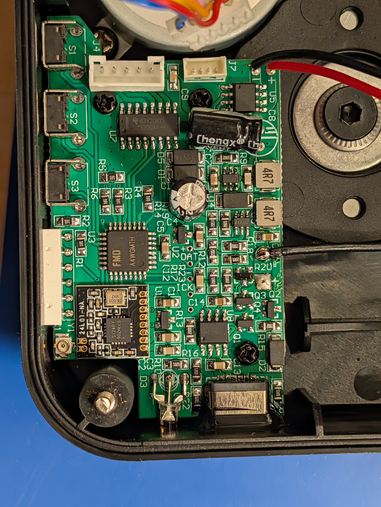
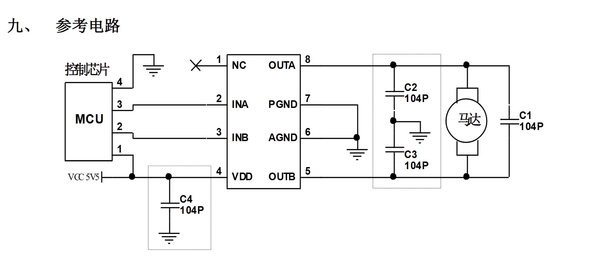
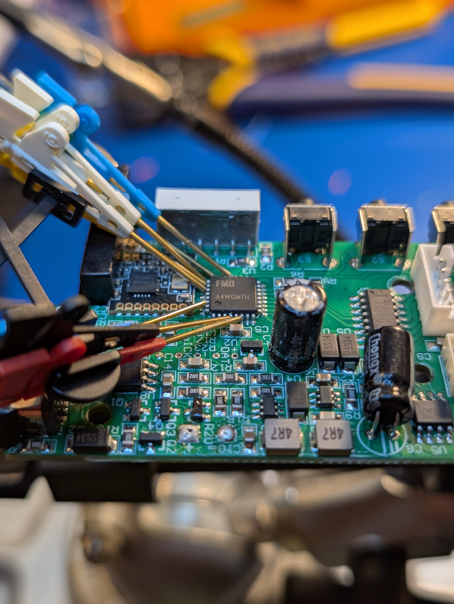
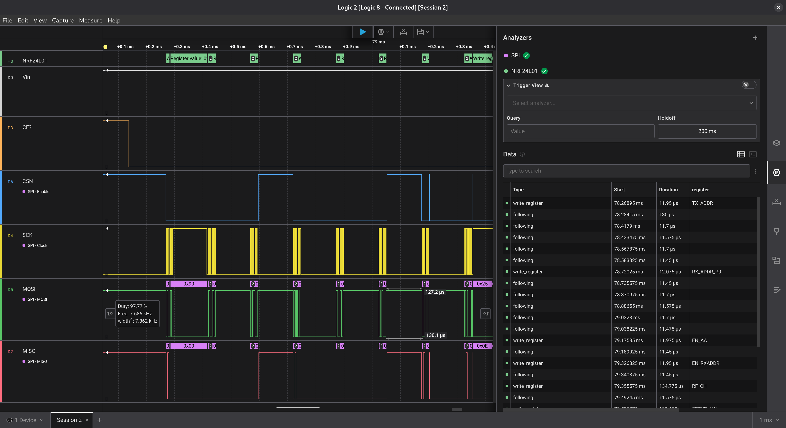

# Reversing the ZiFon YT-1500pro Pan/Tilt Module

During some casual shopping at a local thrift store, I came upon a ZiFon
YT-1500pro pan and tilt module. A quick google search confirmed it was
a pretty good price for what it was (~$20 vs. ~$100 retail) with one
notable exception: the remote was nowhere to be found.

Being someone who can't leave well enough alone and had some time to
spare, I decided this would be a fun little reverse engineering project
and got to work.

## tl;dr

Jump to the [Protocol Description](#protocol-description) section for a breakdown of the RF protocol
of the device. Jump to [Putting It All Together](#putting-it-all-together) for source code to control
the device with an Arduino.

## Goals

Before starting this project, I wanted to define some basic goals to help
guide the process. First, I wanted to recover full functionality of the
device, meaning pan, tilt and A-B cycling should all work roughly the same
as if I did have a remote. Second, I wanted any rework to be minimally
invasive and preserve as much of the original board configuration as
possible; since I only have one of these to play with, nontrivial hardware
rework risks bricking the device, and paying $100+ for a second one defeats
the purpose.

## Initial Exploration

Just from the initial google search, we can tell this thing needs a radio
transmitter, so it should have an FCC record. The module I received does
not have any visible FCC ID, though it does have an FCC logo. Another quick
search takes us to the entry for the device:

https://fccid.io/2A5TN-YT1500PRO

There's definitely some useful information here, like the user manual (although
the manual says it's for a YT2000?) and basic radio spectrum details (the
device uses the 2.4 GHz band for radio communication), but the really juicy
bits like the block diagram and schematic are, predictably, not disclosed
thanks to the "trade secrets" exemption to the Freedom of Information Act
(lol).

A few observations we can make before disassembly:

- There's a 3 digit seven segment that seems to display the channel number,
  (2 digits) plus a third digit that I eventually determined to be battery level
- It has an on/off button and two buttons for changing the channel
- It has a USB-C port for power and charging

That's about it in terms of things that may be useful for figuring out how to
I attached the grabbers to
revive this thing.

## Disassembly

Since we didn't luck out with the FCC, we might as well get started with
the hard work of understanding the internals of the device and its workings.
The device has a pretty nice build quality considering its price and disassembly
is straightforward, with just 4 screws to remove to access the internals.

<!-- FIXME Add disassembly internals photos -->

Inside we find a PCB, a DC motor for the tilt axis and a stepper
motor for the pan axis. There's also an internal battery to allow the device
to pan without wrapping itself up in a charging cord.

I disconnected all the cables, desoldered the battery and DC motor connections
and removed 3 screws to extract the board. I also had to cut the gasket around
the USB-C port, just about the only destructive operation required to
disassemble this device--a much nicer experience compared to most of the cheap
clips and tabs (or worse, ultrasonic welds) used by consumer electronics these
days.

## Component Identification

With the PCB removed, we can get to work identifying the key components:



The most interesting components here are:

- U1, bottom left (the surface-mount daughterboard)
- U3, middle left
- U5, top right
- U7, top center

There are also a few miscellaneous components that I didn't go out of my way
to identify (e.g., U8). They mostly seem to be used for battery charging,
power conditioning, etc. There's also a USB-C port, of course, but it appears
that the data lines are not connected and it's only used for charging.

### U1 - Nordic nRF24L01

This is a pretty common off-the-shelf radio board. It allows mere mortals to
construct working 2.4 GHz-spectrum radio devices without much in the way of
complex RF engineering. It has an SPI interface (we'll come back to that)
and connects to a little antenna adhered to the top of the module via SMB.

### U3 - Fremont Micro Devices ???

This one is a little bit of a mystery. It's a Fremont Micro Devices MCU for
sure, but the exact device is difficult to discern. In my research, I found
that the numbers on the chip are not model numbers but a manufacturing code
of some kind tied to that particular run of chips.

Knowing only the manufacturer and the package (QFP-32 or something close to
it), we can probably nail it down to a very small range of chips. We can also
tell that Vcc appears to be on pin 6. Gemini suggests that's a FT62F08x series
chip, and the pinout and peripheral use does seem to match up with that.
Ultimately, I ended up treating the MCU like a black box anyway so the exact
identification didn't matter for my purposes.

### U5 - TC118 Motor Driver

This is another device that appears to be focused on the Chinese market. The
datasheet suggests it's a fairly simple motor driver; the MCU drives INA
or INB to command the motor to move in one direction or the other. The motor
driver is necessary since the MCU can only source or sink a fairly small
amount of current.



### U7 - ULN2003 Darlington array

This is another motor driver in the guise of a transistor array. Again, it's
just there to protect the MCU from burning out trying to drive current to
the motors. Unlike a simple DC motor, steppers use a series of windings to allow
the motor to "step" between positions; hence the extra pins compared to the
more straightforward.


At this point, we have several possible routes we could pursue. We could try to
dump the firmware off the MCU--this is a bit of a holy grail for most electronics
reverse engineering projects, but it also tends to be the most technically
challenging and frustrating route. These days, many consumer electronics include
safeguards to prevent straightforward memory dumps using attached programmers.
It's common to have to fall back to glitching, firmware exploits or side channel
attacks to get a proper firmware dump. Worse yet, there's limited documentation
for these chips in western markets, they use a nonstandard programming interface,
and what documentation *is* available is in Mandarin.

Another option is to poke the device with an SDR like the HackRF. While this is
definitely a more plausible option, we're limited by the fact we don't have a
remote to play with. If we *did* have a remote, recovering full functionality
might be trivial since many devices like this do not include any protections
against replay attacks; all we'd have to do is record a sample of every keypress
and replay later to perform the same action. Without a remote, we have to reconstruct
the (fairly well-documented) nRF24L01 OTA protocol in addition to just guessing
in the dark at the protocol used by the next layer in the stack.

Ultimately what I decided to do was to listen in to the SPI bus used for
communication with the radio module. Even without a remote, it was likely that
the MCU needed to configure the radio, and maybe we could learn something from that?

## (Micro-)Grabbing Some Data

Time to break out my trusty Pomona 72902 SMD micrograbber kit. These things are
expensive, but they are well worth it if you do this kind of project more than
a few times. They are essentially these tiny little metal hands that grab on
to the leads of a chip without shorting out to the adjacent pins. This allows
an engineer to use a logic analyzer or oscilloscope to observe the signals on
that pin without interfering with the operation of the underlying circuit. If
you've ever used a logic analyzer yourself, you're probably familiar with the
more common grabbers that come with most of them--these are very similar, but
they can reliably connect to chips with pitches as small as 0.2mm. Also, I think
they look Really Cool when you've got them hooked up.



I used my multimeter to buzz out the pins on the nRF24L01 and identify the
corresponding pin on the MCU. I didn't really worry too much about what pin
was what just yet since I had enough grabbers to just probe all of them. I had
to use my microscope to place the grabbers which helps give you a sense of
just how small these things are.

With the grabbers in place, all that was left to do was to hook it up to my
logic analyzer (a recently acquired Saleae Logic 8). I set it up to trigger
on what I believed to be Vcc and powered the device up by plugging it in to
a USB power supply.

This pretty quickly gave me an indication of what pins were what, and I added
the off-the-shelf SPI analyzer in the Saleae app, allowing me to trivially see the
byte-level data being sent over the bus. At this point, I went to look up the
nRF module datasheet to interpret the protocol and found it to be... nontrivial.
It wasn't an insurmountable hurdle, but in poking around I discovered there was
actually a community analyzer that made interpreting the nRF protocol trivial.
This sped things up immensely.



As you can see in the above image, the NRF24L01 analyzer is active and decoding
the meaning of the SPI bytes (currently hidden at the time the screenshot
was taken) according to the module's protocol, making it immediately clear that
(1) this was indeed an nRF24L01 module and (2) disclosing key configuration
details.

## Configuring the Radio

Now that we can see some life on the SPI bus and interpret the packet data, we
can do some datasheet digging and make some observations:

	- the radio uses RF channel 10
	- the MCU configures an identical TX and RX address
	- the device uses a 250kbps data rate
	- the device configures the maximum possible TX power
	- the device uses a 16-bit CRC

These parameters are the kinds of things it would have been nearly impossible to
determine without a working remote, but now we can trivially configure an off-
the-shelf nRF module to talk to this device by matching our module's parameters
with the device.

There's just one catch--we still know almost nothing about the protocol used by
the remote and the device to communicate. Is it a simple one-byte opcode? Is it
variable or fixed width? Is there another layer of CRC or checking? And so on,
and so on.

At this point we could just start fuzzing, but the amount of unknowns means the
search space is incredibly vast. If we could learn anything about the underlying
protocol at all it might dramatically decrease the amount of possible
combinations we need to try.

On a hunch, I decided to try tricking the MCU into thinking there *was* a packet
coming in from the radio. When a packet comes in, what normally happens is that
the nRF module will pull its IRQ line low. This lets the MCU know that data is
available on its read FIFO. The MCU wakes up and polls it for any packets that
have come in. To trick the MCU into reading a packet, all I had to do was pull
the IRQ line low using a small resistor (say 1kOhm)--the resistor probably isn't
necessary but better safe than sorry when working with a device you can't (or,
don't want to) replace.

I set the logic analyzer to watch for this event, and sure enough, the MCU came
back and started reading packets. This gave us the information we needed to
proceed with fuzzing the protocol: the MCU always expected 5 bytes in the
packet. That means there are 2**(5*8) possible packets (about 1 trillion).
While that's still a lot, it's *much* less than the potentially infinite
set of packet formats we were faced with before.

As an aside, it also revealed something about the firmware architechture. I
found that, while holding the IRQ line low, the MCU would continuously try
to read packets from the device (it appears that it assumes that if IRQ is
low, there must be a packet available on the FIFO without checking the status
register from the NRF). Even so, it was possible to change the channel using
the device's display, meaning it's using some kind of parallelism (threads,
interrupts, coroutines, etc.) internally rather than blocking on the SPI read
logic. It's not hard to do, but you don't always see that kind of attention to
detail in a consumer device in this price range.

## The Annoying Part (Fuzzing the Protocol)

We now have everything we need to try to bend the device to our will. It was
time to start the most frustrating part of the process: fuzzing the protocol.
Essentially what this means is just trying different packets until you see
something happen. This is not exactly brute force: we aren't just trying every
packet from 0 to N. Instead, we're making educated guesses about what the
protocol might look like and testing each guess against reality.

As noted, brute forcing this protocol would probably take a *long* time at
1 trillion possible packets. I did consider the possibility of tapping into
the SPI bus more explicitly and emulating the important bits of the nRF SPI
protocol to send candidate packets to the device and, even better, detect when
it commands the motors. However, this approach would have been potentially
destructive, and even then a brute force search would take ~41 years assuming
we can send packets as fast as the MCU's SPI bus is configured for.

Instead, I opted for the tedious process of trying things over the wire and using
the visible functions of the device and the logic analyzer to detect when
something happened. I figured it was worth giving this a shot for at least awhile.

## Aside: The New Remote

Before I get into the rest of the story, I should probably mention a bit about
the hardware I used to send packets to the device. While nRF24L01 modules are
pretty common for hobbyist purposes, I didn't have any on hand. I ordered an
RF-NANO arduino board which combines a basically stock ATmega328P Arduino
Nano bonded to an nRF24L01 module with an external or on-board antenna. To
send packets, I used the off-the-shelf Arduino library for working with
the nRF chip (RF24) and configured the radio with settings matching the device.
I was able to confirm that the radio was configured correctly when I received
a positive acknowledgement from the device--you can see this in the calls to
`radio.write` in the sample code linked at the end of the writeup, but the basic
idea is this:

```
if (radio.write(packet)) {
	/* acked */
} else {
  /* not acked */
}
```

If `write` returns `true`, it means the other end of the connection made an
explicit acknowledgement of the packet. The radio settings pretty much just
worked out of the box, but for the brief moment when I was still playing with
the settings, it made it very clear when things started working.

## The First Packet

After several days of on-and-off probing without, I managed to find the first
packet that I was able to confirm provoked a reaction from the device:

`[0x06 0x23 0x5 0x5 0xa1]`

It's hard to really describe the methodology I used to get to this packet, but
I'll try to break down how I arrived at each byte.

In my research, I found some prior art in the form of a very similar project
for the YT-1000 pan and tilt module by Andrew Wong aka featherbear, described
[here](https://blog.featherbear.cc/post/zifon-yt-1000-wifi-acu/). Initially I
was a little disappointed as I expected the YT-1500pro to use the same protocol
and hardware design, but at some point along the process I realized that the two
were very different: the 1000 model uses a simple UART while the 1500p uses the
nRF module attached via SPI as previously discussed. The protocol described in
featherbear's work is a simple 3-byte protocol ([ID Opcode ID]), while I knew
from my observations that the 1500p model uses a 5 byte frame.

This prior art accounts for two of the bytes in the packet: byte 0 and byte 4.
0x6 was the device channel (distinct from the RF channel, which is always 10)
displayed on the seven segment display. 0xa1 was the result of a loop over all
possible values for the last byte, on the assumption that it was a CRC or check
value.

Bytes 2 and 3 (0x5) were selected to match the third digit of the seven segment
display. I initially assumed this was a speed setting of some kind rather than
a battery level, and I figured maybe the protocol included independent pan and
tilt speeds. I also figured it couldn't hurt to match the speed to what I
thought the actual speed was.

Byte 1 was another product of a for loop, intended to represent the opcode. I
assumed there must be some opcode field to select different operations, and
this seemed like as good a place as any to put it.

Summing all that up, basically: I guessed. This was not my first guess, and
getting a valid packet was not the end of the process, but reverse engineering
basically always involves some combination of skill, equipment and dumb luck.

## Exploring the Protocol

With a working packet in hand, I had a lot more to go on in terms of what would be
allowed and what wouldn't. I confirmed that changing the first byte still worked
as long as the device's channel ID was updated to match (with the caveat that the
RF address *also* embeds the channel ID, which took me awhile to figure out when my
packets suddenly got NACKed). I also explored whether the 0xa1 byte was a checksum
of some kind--it wasn't, as it didn't change with different channel IDs or speed(?)
values. Ultimately, I think it's just a simple check byte: it has to be 0xa1. This
matches one of the bytes in the RF address for the device, suggesting it's a family
code for the YT1500pro devices.

With that out of the way, I iterated through the opcode space and noted any that had
perceptible effects on the motors or display. I didn't identify a way to distinguish
valid opcodes from invalid opcodes beyond these effects, suggesting that there could
be additional functionality that might be discovered through a more sophisticated
approach, like side-channel power analysis. In any case, I was able to recover all
the opcodes for the basic functionality of the remote, so I was satisfied with the
result.

Finally, the two bytes I initially set to 0x5 did indeed turn out to be the pan
and tilt speeds. Valid values for these bytes are 0-8, with the caveat that the
device doesn't actually validate that they're in that range: if you set them to
something higher, it temporarily corrupts the seven segment display, but doesn't
actually speed things up past the maximum speed (8).

## Protocol Description

Finally, we're ready to describe the protocol in full. Every valid frame I've
identified  has the following format:

| Index   |          0 |         1 |         2 |          3 |          0 |
| ------- | ---------- | --------- | --------- | ---------- | ---------- |
| Meaning | Channel ID |    Opcode | Pan Speed | Tilt Speed | Check Byte |
| Values  |       0-99 | See table |       0-8 |        0-8 |       0xa1 |

Valid opcodes are as follows:

| Value | Command               |
| ----- | --------------------- |
|  0x1f | Tilt Up               |
|  0x21 | Tilt Down             |
|  0x23 | Pan Left              |
|  0x25 | Pan Right             |
|  0x29 | Pan to mark A         |
|  0x2b | Pan to mark B         |
|  0x2d | Cycle between A and B |
|  0x2f | Stop all movement     |
|  0x31 | Stop all movement     |
|  0x43 | Set mark position A   |
|  0x45 | Set mark position B   |

Note that all the opcodes I identified are odd numbers. My guess is that this
is due to an implementation quirk in the firmware: it probably uses a jump
table of some kind, and for whatever reason it was easier to start with a 1
byte offset. Or maybe that last bit is reserved for some other meaning.
Without a firmware dump, it's impossible to say for sure.

The other interesting thing is the presence of two duplicate "stop" commands.
As far as I can tell, they have identical behavior; the only difference is the
opcode.

## Putting It All Together

With the protocol fully described (or at least, full enough to support the
original remote functionality) we can finally assemble it all together into
a working remote control API. For now, I've just embedded my support library
into a quick and dirty Arduino sketch, listed below. This sketch will connect
to the device with the given channel ID and run it through all of the possible
movement commands in a loop. It could easily be adapted to support other
platforms or languages, but the key element is access to either a working nRF24L01
module or direct access to the MCU's SPI bus, though the latter requires more work
to emulate the nRF's SPI protocol.

```c++
#include <SPI.h>
#include <RF24.h>

#define CE_PIN 7
#define CSN_PIN 8

enum class YT1500ProOpcode : uint8_t
{
  TILT_UP = 0x1f,
  TILT_DOWN = 0x21,
  PAN_RIGHT = 0x23,
  PAN_LEFT = 0x25,
  MOVE_POSITION_A = 0x29,
  MOVE_POSITION_B = 0x2b,
  CYCLE_POSITIONS = 0x2d,
  STOP = 0x2f,
  SET_POSITION_A = 0x43,
  SET_POSITION_B = 0x45
};

void dumpPacket(const uint8_t *packet, size_t size)
{
  for (size_t i = 0; i < size; ++i) {
    if (i != 0) Serial.print(", ");
    Serial.print(packet[i], HEX);
  }
}

class YT1500Pro
{
public:
  YT1500Pro(rf24_gpio_pin_t cePin, rf24_gpio_pin_t csPin) :
    radio { cePin, csPin },
    channel { 0 }
  {

  }

  bool begin(uint8_t channel)
  {
    if (!radio.begin()) return false;
    radio.setChannel(10);
    radio.setDataRate(RF25_250KBPS);
    radio.setPALevel(RF24_PA_LOW);
    radio.setCRCLength(RF24_CRC_16);
    radio.disableDynamicPayloads();
    radio.setPayloadSize(5);
    setChannel(channel);

    return true;
  }

  bool setChannel(uint8_t channel)
  {
    this->channel = channel;

    uint8_t address[] = { 0x90, 0x70, 0xa1, 0x15, channel };
    radio.openWritingPipe(address);
    radio.stopListening();

    return true;
  }

  void sendCommand(uint8_t opcode, uint8_t panSpeed = 8, uint8_t tiltSpeed = 8)
  {
    uint8_t packet[] = { channel, opcode, panSpeed, tiltSpeed, 0xa1 };

    Serial.print("TX [ ");
    dumpPacket(packet, 5);
    Serial.println("]");
    if (!radio.write(&packet, 5)) {
      Serial.print("radio nacked packet with opcode ");
      Serial.println(opcode, HEX);
    }
  }

  void sendCommand(YT1500ProOpcode opcode, uint8_t panSpeed = 8, uint8_t tiltSpeed = 8)
  {
    sendCommand((uint8_t)opcode, panSpeed, tiltSpeed);
  }

  void panLeft(uint8_t speed = 8) {
    sendCommand(YT1500ProOpcode::PAN_LEFT, speed);
  }

  void panRight(uint8_t speed = 8) {
    sendCommand(YT1500ProOpcode::PAN_RIGHT, speed);
  }

  void tiltUp(uint8_t speed = 8) {
    sendCommand(YT1500ProOpcode::TILT_UP, 8, speed);
  }

  void tiltDown(uint8_t speed = 8) {
    sendCommand(YT1500ProOpcode::TILT_DOWN, 8, speed);
  }

  void panToA(uint8_t speed = 8) {
    sendCommand(YT1500ProOpcode::MOVE_POSITION_A, speed);
  }

  void panToB(uint8_t speed = 8) {
    sendCommand(YT1500ProOpcode::MOVE_POSITION_B, speed);
  }

  void stop() {
    sendCommand(YT1500ProOpcode::STOP, 8, 8);
  }

  void setPositionA() {
    sendCommand(YT1500ProOpcode::SET_POSITION_A);
  }

  void setPositionB() {
    sendCommand(YT1500ProOpcode::SET_POSITION_B);
  }

  void cycleMarks(uint8_t speed = 8)
  {
    sendCommand(YT1500ProOpcode::CYCLE_POSITIONS, speed);
  }

  bool setupFailed() const {
    return failed;
  }

private:
  RF24 radio;
  uint8_t channel;
  bool failed = false;
};

YT1500Pro pantilt { CE_PIN, CSN_PIN };

void setup() {
  Serial.begin(115200);
  while (!Serial) {}
  Serial.println(F("Starting up"));

  if (!pantilt.begin(5)) {
    Serial.println(F("YT1500 init failed"));
    while (1) { }
  }
}

void loop() {
  Serial.println("Waiting to send.");


  while (Serial.read() == -1) {}
  while (Serial.read() != -1) {}

  struct TableEntry {
    const char *name;
    void (*fn)(void);
    unsigned delay;
  };

  TableEntry table[] = {
    { "tilt down", []() { pantilt.tiltDown(); }, 2000 },
    { "tilt up",   []() { pantilt.tiltUp(); }, 2000 },
    { "pan right", []() { pantilt.panRight(); }, 3000 },
    { "set A",     []() { pantilt.setPositionA(); }, 400 },
    { "pan left",  []() { pantilt.panLeft(); }, 4600 },
    { "set B",     []() { pantilt.setPositionB(); }, 400 },
    { "cycle A-B", []() { pantilt.cycleMarks(); }, 20000 }
  };

  while (Serial.available() == 0) {
    for (size_t i = 0; i < sizeof(table) / sizeof(TableEntry); ++i) {
      auto& entry = table[i];
      Serial.print("Testing ");
      Serial.println(entry.name);
      entry.fn();
      delay(entry.delay);
      pantilt.stop();
      delay(1000);
    }
  }

  while (Serial.read() != -1) {}
}
```

## Future Work

Having gone through all that work, I think I'm ready to move on from this project. If
I wanted to take it a little further, I might pair an ESP32 with an nRF module to enable
WiFi control via homeassistant or similar. It might be good to package the YT1500Pro class
into a proper module, though I doubt there's much demand for such a thing. If you really
wanted to solve all the mysteries here, you'd at do some side channel power analysis to
find any debug or reconfiguration opcodes, or explore firmware recovery through glitching
or other methods. For now, I think I'm content with just being able to move the thing
around when I need to.

[def]: ./images/pcb-top.jpg
